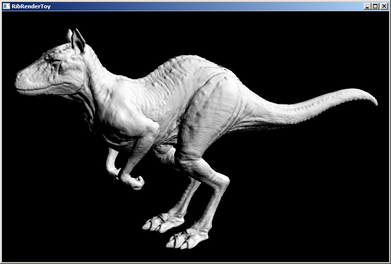
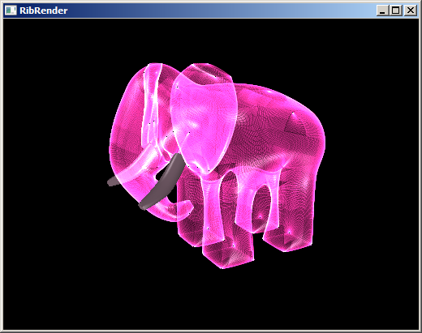
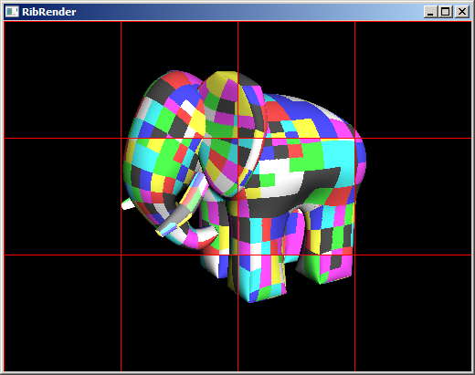

RibTools
========

**RibTools** is an experiment in writing an off-line renderer based on Pixar's [RenderMan interface] and the [REYES] rendering architecture.

> **NOTICE:** Major development was **suspended** in 2010. Only occasional maintenance and refactoring updates are applied.

[RenderMan interface]: http://en.wikipedia.org/wiki/RenderMan_Interface_Specification
[REYES]: http://en.wikipedia.org/wiki/Reyes_rendering

At the core of **RibTools** there is **RibRender**, the rendering engine, built with speed and scalability in mind.

Parallelism is implemented at all levels:
* Instruction level (adaptive N-way SIMD)
* Many-core hardware (multi-threading)
* Network-distributed rendering (custom protocol over TCP/IP)

**RibTools** is a rather crude experiment and it's only tested against a small selection of simple scenes included in the project.

Building & running
------------------

Instructions for Windows and Visual Studio.

1. Launch `make_build.bat`
2. Launch `do_build.bat`
3. Go inside the directory `_distrib` and launch `RibRenderToy.exe` `*`
4. Run
5. Right click in the window to load a test object

That's all !

`*` In case of Windows, it's possible to open the Visual Studio solution located inside `_build\RibTools.sln`.
Make sure to select the *Release* build.

About
-----

**RibTools** was developed by Davide Pasca in 2009-2010. Development is currently suspended.

This software is released under the [New BSD license](http://www.opensource.org/licenses/bsd-license.php) .

This following software libraries are utilized in the project:

* JPEG library: http://www.ijg.org
* freeglut: http://freeglut.sourceforge.net

Other acknowledgements:

* The *Killeroo* model is Copyright of Headus, used with
permission: http://www.headus.com.au

* The *Sponza Atrium*  model is originally from Marko Dabrovic: http://hdri.cgtechniques.com/~sponza/files/ \
The RIB version was taken from the *Lucille* renderer
 distribution and modified as needed: http://lucille.sourceforge.net/

* Most of the included RIB files are old samples that I found included in the *RenSH*
 project: http://www.dctsystems.co.uk/RenderMan/rensh.html

* Other sample scene files were found on the Internet and are assumed to be freely
redistributable.

For any issues regarding attribution, please contact me at `davide@newtypekk.com`.

The *RenderMan&reg; Interface Procedures* and RIB Protocol are: Copyright 1988, 1989,
Pixar. All rights reserved. *RenderMan&reg;* is a registered trademark of Pixar.

